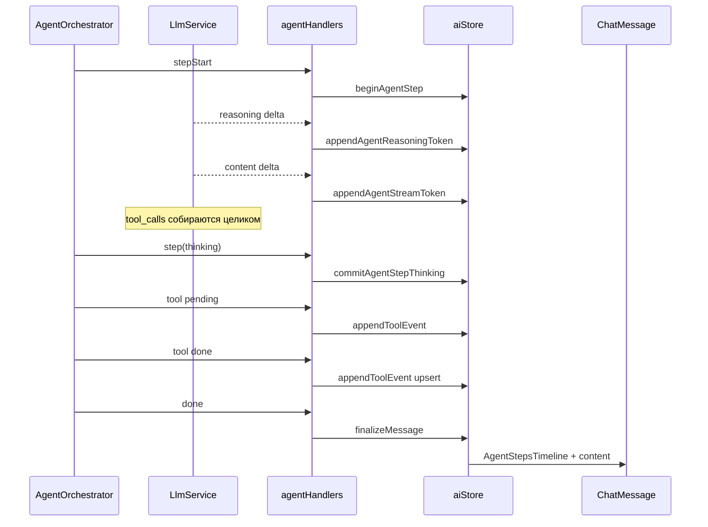

# Agent Streaming UI — спецификация облаков

> **Статус:** реализовано v1 (2026-10-01) — `StreamBubble`, early tool deltas, shell stream, prose buffer  
> **Цель:** при ответе нейросети **сразу** рисовать «облака» (bubbles) по мере стрима — рассуждение, инструменты, консоль, файлы и т.д.

Связанные документы: [handoff.md](./handoff.md) § UX-модель, [cursor-parity-roadmap.md](./cursor/cursor-parity-roadmap.md), [capture-findings.md](./cursor/capture-findings.md).

---

## 1. Референсы (как делают другие)

| Источник | Идея |
|----------|------|
| **Cursor Agent** | Один turn = несколько bubble: thinking → tool(s) → финальный текст. Thinking: «Thought for Xs», live при стриме, сворачивается после. Tool — отдельная карточка на вызов. |
| **MUI X Chat (Reasoning)** | Triplet событий: `reasoning-start` → `reasoning-delta` → `reasoning-end`. Пока `state: streaming` — раскрытый блок «Thinking…» с курсором. |
| **@adambossy/agent-ui** | Pinned status line «Thinking…» пока идёт reasoning; tool cards с состояниями running/done/error; subagent как вложенный turn. |

**Общий паттерн:** не ждать конца turn — **маршрутизировать каждый chunk** в свой визуальный блок в порядке появления.

---

## 2. Что есть сейчас (OpenLLM)

### Поток данных



### Что уже рисуется live

| Тип | Live | Компонент |
|-----|------|-----------|
| Native reasoning (`reasoning_content`) | ✅ частично | `ThinkingBlock` (tail timeline) |
| Legacy `<thinking>` в content | ✅ | `ThinkingBlock` via `extractStreamActivity` |
| Финальный текст ответа | ✅ | markdown в `message.content` |
| Write / StrReplace / Delete | ✅ pending preview | `AgentToolBubble` + `StreamingLinePreview` |
| Shell stdout | ✅ | только `TerminalPanel`, не в чате |

### Известные дыры

1. **Timeline не показывается** только из‑за `agentReasoningBuffer` (gate в `ChatMessage` смотрит только `agentStreamBuffer`).
2. **Tool calls не стримятся** — bubble появляется только после полного JSON аргументов от LLM.
3. **Generic tools** (Shell, Read, Grep…) — только шапка, без тела результата.
4. **Live thinking** всегда в **хвосте** timeline, не привязан к текущему `step`.
5. **Background Task** — bubble остаётся «running», результат уходит в plain text.
6. **Нет единого «Stream Router»** — логика размазана по `aiStore` + эвристикам `thinkingBlocks.ts`.

---

## 3. Целевая модель: Stream Router

Предлагаемый слой **`StreamBlock`** — унифицированная единица UI:

```typescript
type StreamBlockKind =
  | 'reasoning'
  | 'text'           // финальная проза для пользователя
  | 'tool-file'      // Write / StrReplace / Delete
  | 'tool-shell'     // Shell / AwaitShell
  | 'tool-search'    // Grep / Glob / Read / WebSearch / WebFetch
  | 'tool-task'      // Task subagent
  | 'tool-generic'   // остальное
  | 'tool-modal'     // AskQuestion / SwitchMode (блокирующие)
  | 'side-effect'    // TodoWrite / CreatePlan → панели composer

type StreamBlockState = 'streaming' | 'running' | 'done' | 'error'

interface StreamBlock {
  id: string
  step: number
  kind: StreamBlockKind
  state: StreamBlockState
  toolName?: string
  payload: unknown      // см. таблицу ниже
  startedAt: number
  endedAt?: number
}
```

**Renderer:** `AgentStreamTimeline` (замена/обёртка над `AgentStepsTimeline`) — один массив `blocks[]`, append/update по `id`.

**Правило порядка:** блоки идут **строго в порядке первого появления** в стриме (как Cursor / MUI X).

**Scope:** timeline только для режимов **Agent / Plan / Ask** (не legacy `chat` без tools).

---

## 3.1 Единый паттерн bubble (согласовано)

Все блоки с текстом/активностью следуют одной схеме — как в Cursor:

```
┌─ ▶ {шапка: описание действия}          {status} ─┐
│  {строка N-3}                                     │
│  {строка N-2}                                     │
│  {строка N-1}                                     │
│  {строка N}  ▋                                    │  ← live: последние 4 строки
└───────────────────────────────────────────────────┘
```

| Элемент | Правило |
|---------|---------|
| **Шапка** | Краткое описание: «Думаю…», `Shell npm run build`, `[TS] foo.ts +42`, `Grep "pattern"`, `Todo 2/3` |
| **Body (live)** | **4 последние строки** контента, стримятся в реальном времени; прокрутка «хвостом» |
| **Body (done, свёрнут)** | скрыт |
| **Body (done, развёрнут)** | по клику на ▶/▼ — полный контент или больше строк |
| **Стрелка** | Chevron в шапке: свернуть/развернуть |
| **Кнопки действий** | **Нет** («Применить», «Создать файл» и т.п. убраны — agent применяет сам) |
| **Клик по шапке (файлы)** | Открыть файл в редакторе; для StrReplace — **diff по центру** в просмотре (отдельная задача в Editor) |

Компонент-основа: **`StreamBubble`** (header + `TailPreview lines={4}` + expand).

---

## 4. Типы блоков — источник, визуал, поведение

Ниже для каждого типа: **откуда данные**, **когда показывать**, **как выглядит (ASCII mockup)**, **live → done**.

---

### 4.1 Рассуждение (Reasoning / Thinking)

| | |
|---|---|
| **IPC** | `agent:reasoning:{runId}` (native) или `agent:token` + парсинг `<thinking>` |
| **State flow** | `streaming` → `done` (при `agent:step` или конце reasoning stream) |

**Дизайн как Cursor:** приглушённый bubble, italic/muted body, заголовок «Думаю…» / «Thought for 3s».

**Визуал (live):**
```
┌─ ▼ Думаю… ──────────────────────────────── ● ⟳
│  …need to check src/main structure first    │
│  …then create README with project overview  │
│  …user wants streaming UI spec              │
│  …starting with explore subagent▋           │
└────────────────────────────────────────────
```
- **4 последние строки** reasoning, стрим в реальном времени.
- Body **автораскрыт** при live; шрифт muted, без markdown.

**Визуал (done):**
```
┌─ ▶ Думал 3.2с ─────────────────────────────
└────────────────────────────────────────────
```
- Свёрнут; **не схлопывать**, если пользователь сам раскрыл.
- Chevron → полный текст.

---

### 4.2 Финальный ответ (Chat / Prose)

| | |
|---|---|
| **IPC** | `agent:token` → когда буфер **не** похож на agent-step (см. `looksLikeAgentStepBuffer`) |
| **State** | `streaming` → `done` на `agent:done` |

**Визуал (live):**
```
Привет! Я изучил структуру проекта и создал три файла…▋
```
- **Без облачка** — обычный markdown в теле сообщения assistant.
- Курсор `▋` в конце при `isStreaming`.

**Визуал (done):** тот же текст, полный markdown (code blocks, списки).

**Правило:** prose **всегда последним блоком** turn (после tools), даже если токены пришли раньше — буферизовать до `done` step или до явного «reply phase» (как Cursor разделяет thinking/tools/text).

---

### 4.3 Файл: создание (Write)

| | |
|---|---|
| **Tool** | `Write` |
| **IPC** | `agent:tool` pending → done |
| **Phase 1 (сейчас)** | pending с args `path`, `contents` |
| **Phase 2 (цель)** | incremental `tool_calls` delta → partial `contents` стрим |

**Визуал (pending / streaming):**
```
┌─ [TS] src/main/foo.ts          +42  ● ⟳ ────┐
│  1 │ + import { x } from 'y'                  │
│  2 │ + export function foo() {                │
│  3 │ +   return 1                             │
│  4 │ + }                                      │
└───────────────────────────────────────────────┘
```
- Иконка типа файла, относительный путь, счётчик `+N`.
- **4 строки** preview с анимацией появления (как `StreamingLinePreview`).
- При стриме args — **обновлять preview** по мере дописывания `contents` (Phase 2).

**Визуал (done):**
```
┌─ [TS] src/main/foo.ts          +42  ✓ ─────── (клик → открыть)
└───────────────────────────────────────────────
```
- Только шапка, preview скрыт.
- Клик по шапке → `openTab`.

---

### 4.4 Файл: правка (StrReplace)

| | |
|---|---|
| **Tool** | `StrReplace` |
| **Preview** | pending: `new_string`; done: diff old/new если есть `oldContent` |

**Визуал (pending):**
```
┌─ [TS] src/App.tsx              +3 -1  ● ⟳ ──┐
│  42│ -  cwd={workspace?.path}               │
│  42│ +  cwd={workspace?.path ?? ''}         │
└─────────────────────────────────────────────┘
```
- Красный `-` / зелёный `+` (как сейчас diff rows).

**✅ Решение (done):** шапка + **4 строки diff** (tail preview). **Клик по шапке** → открыть файл в редакторе с **diff по центру** (scroll to first change — задача Editor, не bubble).

---

### 4.5 Файл: удаление (Delete)

**Визуал (pending):**
```
┌─ [TS] old-file.ts              −12  ● ⟳ ────
└───────────────────────────────────────────────
```

**Визуал (done):**
```
┌─ [TS] old-file.ts              −12  ✓ ──────
└───────────────────────────────────────────────
```
- Без open on click.

---

### 4.6 Папка (mkdir через Shell или явный path)

**Визуал:**
```
┌─ 📁 created folder  src/components/New ───── ✓
└───────────────────────────────────────────────
```
- Уже есть в `AgentToolBubble` для `directoryPath`.

---

### 4.7 Консоль / Shell

| | |
|---|---|
| **Tool** | `Shell`, `AwaitShell` |
| **IPC tool** | pending → done (ранний bubble при partial args — S3) |
| **IPC output** | `agent:shellOutput:{sessionId}` → append в body bubble |

**✅ Решение:** шапка + **4 строки вывода** (последние), chevron → развернуть полный лог.

**Визуал (running):**
```
┌─ ▼ Shell  npm run build:dir ─────────── ● ⟳ ┐
│  > openllm@1.0.0 build:dir                  │
│  vite v6.4.1 building...                    │
│  ✓ 1181 modules transformed.                │
│  ✓ built in 15.88s▋                         │
└─────────────────────────────────────────────┘
```

**Визуал (done, свёрнут):**
```
┌─ ▶ Shell  npm run build:dir ─────── exit 0 ✓
└───────────────────────────────────────────────
```

- Полный лог по-прежнему дублируется в **Terminal panel** (нижняя панель).
- AwaitShell: шапка «Ожидание shell… N ms».

---

### 4.8 Поиск / чтение (Read, Grep, Glob, ReadLints)

**Визуал (running):**
```
┌─ Grep  "AgentOrchestrator"  src/ ─── ● ⟳ ───
└───────────────────────────────────────────────
```

**Визуал (done):**
```
┌─ ▶ Grep  "AgentOrchestrator" ─── 12 matches ✓ ┐
│  src/main/agent/AgentOrchestrator.ts:40       │
│  src/main/agent/AgentOrchestrator.ts:92       │
│  … (+9, развернуть)                           │
└───────────────────────────────────────────────┘
```
- Done: первые 3–5 строк результата, «+N ещё».
- Read: показать `path` + «N lines» или preview первых строк.

---

### 4.9 Web (WebSearch, WebFetch)

**Визуал (running):**
```
┌─ 🌐 WebSearch  "Monaco scrollbar styling" ─ ● ⟳
└───────────────────────────────────────────────
```

**Визуал (done):**
```
┌─ ▶ WebSearch ─────────────────────────── 5 results ✓ ┐
│  • Monaco editor scrollbars — Microsoft docs         │
│  • Custom vscode theme scrollbarSlider…              │
└──────────────────────────────────────────────────────┘
```

---

### 4.10 MCP (GetDynamicTools, CallDynamicTool, FetchMcpResource)

**Визуал (running):**
```
┌─ MCP  user-opencli / find_content ─── ● ⟳ ───
└───────────────────────────────────────────────
```

**Визуал (done):** шапка + truncated JSON/text result (expand).

---

### 4.11 Subagent (Task)

**Визуал (running, foreground):**
```
┌─ ∞ Subagent: Explore src/main ─ explore ● ⟳ ┐
│  Scanning agent handlers and tool registry…  │
└──────────────────────────────────────────────┘
```

**Визуал (background `run_in_background: true`):**
```
┌─ ∞ Subagent: Explore game/ ─ explore  ⏳ фон ─┐
└───────────────────────────────────────────────
```
- При завершении: upsert bubble → `done` + preview ответа (не только append в prose).

**Визуал (done):**
```
┌─ ▶ Subagent: Explore src/main ─ 4 steps ✓ ───┐
│  Found 78 modules in src/main…               │
└──────────────────────────────────────────────┘
```

---

### 4.12 Todo (TodoWrite)

**✅ Решение:** bubble **в чате** (timeline) + обновление composer cap.

**Визуал (live / done):**
```
┌─ ▼ Todo  2/3 ─────────────────────────── ✓ ──┐
│  ☑ Исследовать структуру                     │
│  ☑ Написать спецификацию                     │
│  ☐ Реализовать Stream Router                 │
│  ☐ Тесты                                     │
└──────────────────────────────────────────────┘
```
- Шапка: `Todo N/M`; body — последние 4 пункта списка (или 4 строки статусов).
- Composer cap синхронизирован с тем же state.

---

### 4.13 Plan (CreatePlan)

| | |
|---|---|
| **UI** | `PlanPanel` над messages + файл `.openllm/plans/*.md` |

**Визуал bubble (опционально):**
```
┌─ ☰ Plan  agent-streaming-ui ────────────── ✓ ┐
│  Phase 1: StreamBlock model                 │
│  Phase 2: Router in aiStore                 │
└───────────────────────────────────────────────┘
```

---

### 4.14 Модальные инструменты (AskQuestion, SwitchMode)

**Не bubble в потоке** — блокирующие overlay (как сейчас).

**Индикатор в timeline (опционально):**
```
┌─ ? Ожидание ответа пользователя ────────── ⏸ ───
└───────────────────────────────────────────────
```
- Пока modal открыт, agent paused.

---

### 4.15 Notebook (EditNotebook)

**Визуал:**
```
┌─ EditNotebook  analysis.ipynb  cell 2 ─ ● ⟳ ┐
│  + import pandas as pd                        │
└───────────────────────────────────────────────┘
```
- Аналог Write preview для `new_string` / cell content.

---

### 4.16 Индикатор шага (Step progress)

| | |
|---|---|
| **IPC** | `agent:stepStart` `{ step, maxSteps }` |

**✅ Решение:** показывать **Шаг N/M** между step groups. `maxSteps` определяется из настроек агента (`agentMaxSteps`), не хардкод.

**Визуал:**
```
── Шаг 2 / 25 ──────────────────────────────────
```
- Тонкая muted строка-разделитель перед bubbles нового step.

---

## 5. Компоновка turn (пример полного ответа)

```
User: «Исследуй src/main и создай README»

┌─ ▼ Думаю… ─────────────────────────── ● ⟳ ──┐
│  Need to explore structure first…▋          │
└─────────────────────────────────────────────┘

┌─ ▶ Grep  "export function"  src/main ─ ✓ ───┐  ← done, collapsed
└─────────────────────────────────────────────┘

┌─ ∞ Subagent: Explore handlers ─ explore ● ⟳ ─┐
│  …                                           │
└─────────────────────────────────────────────┘

┌─ [MD] README.md                    +48 ● ⟳ ─┐
│  1 │ + # OpenLLM                              │
│  2 │ + Agent streaming UI…                    │
└─────────────────────────────────────────────┘

┌─ [MD] README.md                    +48 ✓ ─── (done)

Готово! Изучил `src/main`, добавил README с описанием…
```

---

## 6. Фазы реализации

| Фаза | Scope | Приоритет |
|------|--------|-----------|
| **S0 — быстрые фиксы** | Gate `agentReasoningBuffer`; Task background upsert; убрать кнопки «Применить» | ✅ |
| **S1 — StreamBubble + TailPreview** | `StreamBubble.tsx`, рефактор `ThinkingBlock`, `AgentToolBubble` | ✅ |
| **S2 — Early streaming** | `onToolCallDelta` в `LlmService` → pending bubble при стриме args | ✅ |
| **S3 — Tool bodies** | Shell output в bubble; Todo/Grep/Read tail; `agentProseBuffer` | ✅ |
| **S4 — Editor integration** | `openTabAtLine` + `revealLineInCenter` для StrReplace | ✅ |
| **S5 — Polish** | Step N/M divider, «Думал Xs» | ✅ |

---

## 7. Решения (согласовано 2026-10-01)

| # | Вопрос | Решение |
|---|--------|---------|
| 1 | Shell | Шапка + 4 строки вывода; chevron → полный лог; Terminal panel остаётся |
| 2 | TodoWrite | Bubble **в чате** + composer cap |
| 3 | Step N/M | **Да**, `maxSteps` из настроек агента |
| 4 | StrReplace done | Шапка + 4 строки diff; клик → файл с diff **по центру** редактора |
| 5 | Prose vs tools | **Да** — финальный текст всегда **после** всех tool bubbles |
| 6 | Приоритет | **Ранний bubble + стриминг args** (S2 перед S3) |
| 7 | Scope timeline | Только **Agent / Plan / Ask** (не plain chat) |

**Дополнительно:**
- Все text bubbles: единый паттерн §3.1 (шапка + 4 строки tail).
- Reasoning: дизайн как Cursor, 4 строки live.
- Кнопки «Применить изменения» / «Создать файл» в чате — **убрать** (agent сам пишет файлы).

---

## 8. Файлы для изменения (когда пойдём в код)

| Слой | Файлы |
|------|--------|
| Stream model | `src/shared/agent/streamBlocks.ts` (новый) |
| Main emit | `AgentOrchestrator.ts`, `LlmService.ts` (partial tool_calls) |
| Store | `aiStore.ts` — `appendStreamBlock`, `updateStreamBlock` |
| UI | `AgentStreamTimeline.tsx`, рефактор `AgentToolBubble`, `ThinkingBlock` |
| Gate | `ChatMessage.tsx` — `hasAgentTimeline` |
| Shell stream | bridge `shellOutput` → block id по `toolId` |

---

*Обновлено: 2026-10-01 — решения зафиксированы, реализация с фазы S1/S2.*
