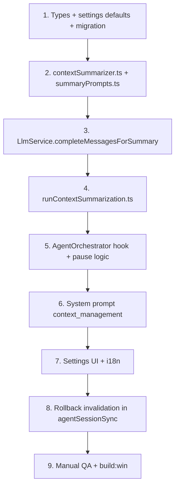

# План: LLM-суммаризация контекста агента (Plan B)

> **Статус:** implemented (v1)  
> **Дата:** 2026-10-02  
> **Implemented:** 2026-10-02  
> **Связано:** [handoff.md](../handoff.md), [agent-migration-plan.md](../cursor/agent-migration-plan.md)

---

## Цель

Когда контекст агента заполняется (~90%), **сжимать середину диалога через отдельный LLM-вызов** (~80% reduction), **не меняя UI чата**. Модель продолжает задачу по `<conversation_summary>` + последним turns.

**Plan B** = LLM-summary (не просто `trimAgentHistory`). Опциональный детерминированный pre-squeeze tool outputs — вспомогательный шаг, не замена LLM.

---

## Не-цели (явно)

| Не делаем | Почему |
|-----------|--------|
| Менять `ChatSession.messages` (UI лента) | Пользователь видит полную историю |
| Добавлять summary-bubble в чат | Ломает UX |
| Суммаризировать system / bootstrap | Технический контекст священен |
| Суммarizировать последние K turns | «Живая нить» |
| Plan / Ask / legacy Chat в v1 | Только Agent (`agentMessages`) |
| Копировать Cursor 1:1 | У Cursor summary на своём бэкенде, недоступен перехватом |

---

## Текущее состояние проекта (аудит 2026-10-02)

### Два слоя истории — уже есть

| Слой | Хранение | Назначение |
|------|----------|------------|
| **UI** | `ChatSession.messages` | bubbles, tool timeline, thinking — **renderer** |
| **API** | `agentMessages` + `agentSessionStore` (main) | payload для LLM |

Синхронизация:

- После run: `persistAgentMessages()` → `window.api.agentGetSessionMessages` → пишет в `session.agentMessages` → `chat-sessions.json`
- При старте таба: `syncAgentSession()` → `agentRestoreSession`
- При edit/rollback: `trimAgentMessagesToChat()` режет API-историю под UI

### Где сейчас «сжимается» контекст

1. **`LlmService.trimAgentHistory()`** — перед каждым agent stream call: pin `system` + bootstrap (`<user_info>`), остальное — tail-only drop. **Без LLM.**
2. **`AgentOrchestrator`** — при `contextUsagePercent >= agentContextStopPercent` (default **92%**): `pauseReason: 'context'`, batch стоп. **Summary не вызывается** — только пауза / auto-continue со старым trim.
3. **i18n** (`agentContextStopHint`) обещает «история сжимается» — фактически пока только trim в п.1.

### Ключевые файлы

| Файл | Роль |
|------|------|
| `src/main/agent/AgentOrchestrator.ts` | agent loop, pause на context %, `setAgentSessionMessages` |
| `src/main/services/LlmService.ts` | `completeMessages` / `completeMessagesStream`, `trimAgentHistory` |
| `src/main/agent/agentSessionStore.ts` | in-memory `agentMessages` по `sessionId` |
| `src/renderer/src/store/aiStore.ts` | UI state, `persistAgentMessages`, auto-continue batch |
| `src/shared/agent/agentSessionSync.ts` | `trimAgentMessagesToChat` при rollback |
| `src/shared/agent/contextBuilder.ts` | bootstrap + turn user messages |
| `src/shared/agent/promptBuilder.ts` | system prompt assembly |
| `src/shared/agent/agentSettings.ts` | defaults agent limits |
| `src/shared/types.ts` | `AppSettings`, `ChatSession.agentMessages` |

### Структура `agentMessages` (native tools)

```
[0] role: system
[1] role: user     — bootstrap (<user_info>, skills, …)
[2..] turns:
      user   — <user_query> + attachments + open files
      assistant — content + tool_calls?
      tool   — results (может быть много подряд)
      …
```

Turn = от user-сообщения с `<user_query>` до следующего такого user (включая assistant/tool между ними).

---

## Архитектура Plan B

### Принцип

```
┌─────────────────────────────────────────────────────────┐
│  UI (ChatSession.messages)          NEVER MODIFIED       │
└─────────────────────────────────────────────────────────┘
                            │
                            │ persist только API-слой
                            ▼
┌─────────────────────────────────────────────────────────┐
│  agentMessages                                           │
│  [system][bootstrap][ SUMMARY? ][ middle→removed ][tail] │
└─────────────────────────────────────────────────────────┘
                            │
         context ≥ threshold │
                            ▼
              ┌─────────────────────────┐
              │  Summary side-call      │
              │  (no tools, English)    │
              └─────────────────────────┘
                            │
                            ▼
              replace middle → 1× user w/ <conversation_summary>
```

### Pin-зоны

| Зона | Индексы | Правило |
|------|---------|---------|
| **Head** | `[0]` system, `[1]` bootstrap | Никогда не summarizer |
| **Middle** | `[2 .. len-K-1]` | Сериализовать → LLM compress → заменить одним блоком |
| **Tail** | последние **K turns** (default **3**) | Не трогать; резать только по границе turn |

Если middle пуст (мало истории) — skip.

### Когда запускать

**Перед** очередным LLM-step в `AgentOrchestrator`, если:

```ts
agentSummarizeEnabled
&& estimateTokens(messages) / contextTokens * 100 >= agentSummarizeAtPercent
&& middleSegment.length > 0
```

После успешного summary:

- **mode `auto`:** продолжить run без `pauseReason: 'context'` (если после сжатия % ниже порога)
- **mode `pause`:** pause как сейчас, но history уже с summary — continue с меньшим ctx

`trimAgentHistory` в `LlmService` остаётся **last-resort** на отправке.

---

## LLM summary call (Plan B core)

### Отдельный вызов

- API: `LlmService.completeMessages()` — **не mutates** chat history ✓
- `stream: false` (дешевле проще для meta-task)
- **Без `tools`**
- Модель: `agentSummarizeModelId ?? activeModelId`

### Meta-prompts (English, только summary-call)

**System:**

```text
You compress coding-agent conversation history for context window management.
Output a dense factual summary in markdown. Do not invent details not present in the segment.
```

**User:**

```text
Compress the conversation segment below to roughly {targetPercent}% of its original length
(approximately {100-targetPercent}% reduction).

MUST preserve:
- User's overall goal and current task state
- Key decisions and rationale
- Files created, modified, or deleted (with paths)
- Errors encountered and fixes attempted
- Open questions and TODOs
- Important shell commands and their outcomes

OMIT:
- Full file contents and large tool outputs
- Repeated reasoning and pleasantries
- Redundant tool-call details (keep path + outcome only)

Reply with ONLY the summary body (markdown). No preamble.

--- CONVERSATION SEGMENT ---
{serializedMiddle}
```

`targetPercent = round(agentSummarizeTargetRatio * 100)` — default **20** (= ~80% reduction).

### Сериализация middle для summary-call

Новый helper `serializeAgentSegmentForSummary(messages: AgentChatMessage[]): string`:

- system-like labels: `[USER]`, `[ASSISTANT]`, `[TOOL name=Read]`
- tool content: truncate до N chars (e.g. 2000) **только в serialization**, не в stored history
- strip `<think>` / reasoning из копии для summary input

### Injection в основную историю

Middle заменяется **одним** user message:

```xml
<system_notification>
Earlier conversation was automatically compressed to free context window space.
The chat UI still shows the full history; rely on the summary below for prior work.
</system_notification>

<conversation_summary>
{summaryMarkdown}
</conversation_summary>
```

**Не** добавлять fake assistant ack.

### Rolling summary (2+ compression)

Если в middle уже есть сообщение с `<conversation_summary>`:

- Сериализовать: `[existing summary block] + [new middle since last summary]`
- Один новый summary block заменяет всё middle (не summary-of-summary вслепую без исходника)

---

## System prompt агента (постоянно)

Добавить в `src/shared/agent/prompts/agentSystemBody.ts` (и plan/ask bodies — позже):

```xml
<context_management>
Long agent sessions may be compressed automatically. When you see
<conversation_summary>, treat it as faithful prior context. Continue the task
without asking the user to repeat information already covered in the summary,
unless a specific detail is missing or ambiguous.
</context_management>
```

Сборка через `promptBuilder.ts` — блок в agent (+ plan при необходимости).

---

## UI / UX

| Элемент | Поведение |
|---------|-----------|
| Chat bubbles | **без изменений** |
| Tool timeline | **без изменений** |
| Context ring | после summary `prompt_tokens` должен **упасть** |
| Status bar (optional P1) | краткий toast «Context compressed» 2s через `uiStore.setStatusMessage` |
| Settings | новая секция / группа в Agent |

**Не** писать summary в `ChatMessage.content`.

---

## Настройки

### Новые ключи `AppSettings`

| Key | Type | Default | Описание |
|-----|------|---------|----------|
| `agentSummarizeEnabled` | boolean | `true` | Master switch |
| `agentSummarizeAtPercent` | number 50–99 | `90` | Порог срабатывания |
| `agentSummarizeTargetRatio` | number 0.1–0.5 | `0.2` | Целевой размер (~20% = −80%) |
| `agentSummarizeKeepRecentTurns` | number 1–5 | `3` | Tail turns |
| `agentSummarizeMode` | `'auto' \| 'pause'` | `'auto'` | auto = summarize+continue; pause = summarize+pause batch |
| `agentSummarizePreSqueeze` | boolean | `true` | Pre-pass: truncate tool bodies in middle **копии** перед LLM (не mutate store) |
| `agentSummarizeModelId` | string \| null | `null` | null = active model |

### Миграция settings

- `agentLimitsVersion: 3` в `SettingsService`
- `agentSummarizeAtPercent` ← `agentContextStopPercent` если уже задан
- **`agentContextStopPercent`:** deprecate в UI (скрыть или alias hint), оставить в типе для backward compat **или** удалить после миграции — см. TODO

### UI размещение

`SettingsModal.tsx` → секция Agent → группа **«Суммаризация контекста»**:

- checkbox enabled
- at percent (number)
- target ratio (slider или number 10–50%)
- keep recent turns
- mode select
- pre-squeeze checkbox
- optional model dropdown (из `apiModels`)

+i18n в `src/shared/i18n.ts`, WelcomeScreen hints (optional).

---

## Новые модули

### `src/shared/agent/contextSummarizer.ts` (shared, testable)

```ts
// Экспортируемые функции (черновик API):

export type SummarizeSettings = { ... from AppSettings subset ... }

export function splitAgentHistoryForSummary(
  messages: AgentChatMessage[],
  keepRecentTurns: number
): { head: AgentChatMessage[]; middle: AgentChatMessage[]; tail: AgentChatMessage[] }

export function squeezeToolOutputsForSummary(messages: AgentChatMessage[]): AgentChatMessage[]

export function serializeAgentSegmentForSummary(messages: AgentChatMessage[]): string

export function buildSummaryInjectionMessage(summaryMarkdown: string): AgentChatMessage

export function isConversationSummaryMessage(msg: AgentChatMessage): boolean

export function mergeHistoryAfterSummary(
  head: AgentChatMessage[],
  summaryMessage: AgentChatMessage,
  tail: AgentChatMessage[]
): AgentChatMessage[]

export function estimateAgentMessagesTokens(messages: AgentChatMessage[]): number
```

### `src/shared/agent/summaryPrompts.ts`

- `SUMMARY_SYSTEM_PROMPT`
- `buildSummaryUserPrompt(serialized: string, targetRatio: number)`

### `src/main/agent/runContextSummarization.ts` (main-only)

- читает settings + model registry
- вызывает `llmService.completeMessagesForSummary()` (wrapper)
- error handling + fallback

### `LlmService` extension

```ts
async completeMessagesForSummary(
  system: string,
  user: string,
  modelId?: string | null
): Promise<string>
```

- использует указанную модель или active
- **не** применять `trimHistory` к full agent history — summary input отдельный короткий payload
- `stream: false`, no tools

---

## Интеграция в AgentOrchestrator

### Hook point

В начале каждой итерации step-loop **перед** `completeMessagesStream` / native stream:

```ts
if (shouldSummarize(messages, settings)) {
  messages = await trySummarizeAgentHistory(messages, sessionId, callbacks)
  // optional: callbacks.onContextSummarized?.()
}
```

### Context pause logic

Заменить текущий блок:

```ts
if (lastUsage && contextUsagePercent(...) >= agentContextStopPercent) {
  paused = true; pauseReason = 'context'
}
```

На:

1. Попытка summary (если enabled)
2. Re-check tokens
3. Если всё ещё ≥ threshold → pause (mode `pause`) или trim fallback
4. Если mode `auto` и summary помог → **не** pause

### Session persist

После summary: `setAgentSessionMessages(sessionId, messages)` — как после обычного step.

Renderer подхватит через существующий `persistAgentMessages` в конце batch.

---

## Edge cases (обязательно в реализации)

### 1. Edit / rollback / regenerate

`trimAgentMessagesToChat()` матчит user turns по `<user_query>`. Summary block **не** содержит `<user_query>`.

**Правило:** при любом `syncAgentSessionFromChat`:

- удалить **все** messages где `isConversationSummaryMessage(msg)`
- восстановить API history = trim по UI (как сейчас)
- summary будет пересоздан при следующем threshold (lazy)

TODO: unit test в `agentSessionSync` + summary invalidation.

### 2. Неполные tool chains в tail

`splitAgentHistoryForSummary` режет tail по **turn boundaries**, не по raw message index.

Algorithm:

1. Найти все user-turn start indices (user msg с `<user_query>`, index > 1)
2. Tail = последние K turn starts → от min index до end

### 3. Summary call fails (timeout, HTTP, empty)

Fallback chain:

1. `agentSummarizePreSqueeze` on middle copy → inject squeezed middle? **No** — не inject raw middle
2. Fallback: `trimAgentHistory` only (current behavior)
3. Log warning; optional `pauseReason: 'context'`

### 4. Summary call itself exceeds context

- Pre-squeeze harder (lower tool truncate limit)
- Split middle into chunks → partial summaries → merge summary-call (P2)
- v1: chunk not required if pre-squeeze + 90% threshold leaves headroom

### 5. `continueRun` / auto-continue batch

Summary может сработать **mid-batch** — OK. `agentMessages` persisted with summary; UI streaming продолжается на том же assistant message.

### 6. Subagent `Task` tool

Subagents имеют **отдельный** session / message list в `subagentRunner.ts` — **вне scope v1**. Document as future work.

### 7. Duplicate `isBootstrapUserMessage`

Сейчас копия в `LlmService.ts` и canonical в `modeReminders.ts`. Новый код — **только** import из `modeReminders.ts`.

### 8. Native vs XML legacy

Summary serialization must handle both:

- native: `assistant.tool_calls` + `role: tool`
- legacy XML: assistant content string — strip for summary input

---

## Тестирование

### Manual checklist

- [ ] Long agent run (many Read/Grep) → context ring →90% → run continues, UI unchanged
- [ ] Full chat scroll shows all user/tool bubbles; no summary bubble
- [ ] After summary, agent answers «what was the first file we edited?» correctly
- [ ] Settings: disable summarize → old trim-only behavior
- [ ] Settings: mode pause → batch pauses after summarize
- [ ] Edit old user message → summary blocks removed from API; no crash
- [ ] Restart app → compressed `agentMessages` restored; UI still full
- [ ] Separate summarize model (if configured) used in llm debug log label

### Unit tests (vitest / node test — если есть runner)

- `splitAgentHistoryForSummary` — K turns, empty middle, tool chains
- `isConversationSummaryMessage`
- `mergeHistoryAfterSummary`
- `trimAgentMessagesToChat` + prior summary → summary stripped on rollback

---

## Порядок реализации



---

## TODO для реализации (явный чеклист)

> Отмечать по мере выполнения. Не начинать следующий блок, пока не закрыт предыдущий там, где есть зависимость.

### Phase 1 — Settings & types

- [x] **T1.1** Добавить поля summarize в `AppSettings` (`src/shared/types.ts`)
- [x] **T1.2** Defaults в `AGENT_SETTINGS_DEFAULTS` (`src/shared/agent/agentSettings.ts`)
- [x] **T1.3** Migration `agentLimitsVersion: 3` в `SettingsService.ts` (map `agentContextStopPercent` → `agentSummarizeAtPercent`)
- [x] **T1.4** i18n keys RU (`src/shared/i18n.ts`)
- [x] **T1.5** Settings UI группа (`SettingsModal.tsx`) + WelcomeScreen hints (optional)

### Phase 2 — Core summarizer (shared)

- [x] **T2.1** Создать `src/shared/agent/summaryPrompts.ts` (EN meta-prompts)
- [x] **T2.2** Создать `src/shared/agent/contextSummarizer.ts`:
  - [x] `splitAgentHistoryForSummary` (turn-aware tail)
  - [x] `isConversationSummaryMessage`
  - [x] `serializeAgentSegmentForSummary`
  - [x] `squeezeToolOutputsForSummary` (copy-only)
  - [x] `buildSummaryInjectionMessage`
  - [x] `mergeHistoryAfterSummary`
  - [x] `estimateAgentMessagesTokens` (reuse logic from LlmService or extract shared)
- [ ] **T2.3** Unit tests для split/merge/isSummary (если test runner доступен)

### Phase 3 — LLM side-call (main)

- [x] **T3.1** `LlmService.completeMessagesForSummary(system, user, modelId?)` — no tools, stream false
- [x] **T3.2** Model override: временно switch config на `agentSummarizeModelId` или pass model in payload
- [x] **T3.3** `src/main/agent/runContextSummarization.ts` — orchestration + fallback
- [x] **T3.4** Debug log label `completeMessagesForSummary` в `llmApiDebugLog`

### Phase 4 — AgentOrchestrator integration

- [x] **T4.1** Helper `shouldSummarize(messages, settings, usage?)`
- [x] **T4.2** Hook перед каждым LLM step в run loop
- [x] **T4.3** Заменить `pauseReason: 'context'` logic: summarize first → re-check → pause only if needed
- [x] **T4.4** Respect `agentSummarizeMode` auto vs pause
- [x] **T4.5** `setAgentSessionMessages` после successful summary
- [x] **T4.6** Optional callback / status message для toast (renderer via existing IPC event или reuse context usage event)

### Phase 5 — System prompt

- [x] **T5.1** `<context_management>` block в `agentSystemBody.ts`
- [x] **T5.2** Подключить в `promptBuilder.ts` для agent mode
- [x] **T5.3** Regenerate / verify agent system prompt length OK

### Phase 6 — Rollback & persistence safety

- [x] **T6.1** В `trimAgentMessagesToChat` или `syncAgentSessionFromChat`: strip summary messages on UI sync
- [x] **T6.2** Verify `persistAgentMessages` persists compressed API history without touching UI messages
- [ ] **T6.3** Verify app restart: `agentRestoreSession` loads summary-enriched history

### Phase 7 — QA & docs

- [ ] **T7.1** Manual test checklist (секция выше)
- [x] **T7.2** `npm run build:win`
- [x] **T7.3** Обновить этот doc: status → implemented, дата, known limits
- [ ] **T7.4** Короткая заметка в `handoff.md` § Agent context

---

## Known limits / Future (не v1)

- Ask / Plan / Chat modes
- Subagent sessions (`Task` tool) — отдельная summarization per subagent
- Chunked summary для extremely large middle
- User-visible «View compressed context» debug panel
- Отдельная fast model preset в model registry

---

## Решения на ревью (ожидают подтверждения пользователя)

| # | Вопрос | Proposal |
|---|--------|----------|
| R1 | Убрать `agentContextStopPercent` из UI? | Да — заменить на `agentSummarizeAtPercent` |
| R2 | Default mode | `auto` (summarize + continue) |
| R3 | Default keepRecentTurns | `3` |
| R4 | Toast при summary | Да, 2s status message (P1, можно в v1) |
| R5 | Pre-squeeze in v1 | Да, default on — улучшает quality summary-call |

---

## Связанные файлы (touch list)

```
src/shared/types.ts
src/shared/i18n.ts
src/shared/agent/agentSettings.ts
src/shared/agent/summaryPrompts.ts          (new)
src/shared/agent/contextSummarizer.ts       (new)
src/shared/agent/agentSessionSync.ts
src/shared/agent/prompts/agentSystemBody.ts
src/shared/agent/promptBuilder.ts
src/main/services/SettingsService.ts
src/main/services/LlmService.ts
src/main/agent/runContextSummarization.ts   (new)
src/main/agent/AgentOrchestrator.ts
src/renderer/src/components/Modals/SettingsModal.tsx
docs/handoff.md                             (after impl)
```

---

*После ревью пользователя → реализация по TODO Phase 1–7.*
