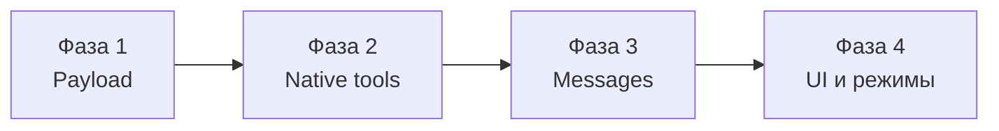

# OpenLLM → Cursor API parity — дорожная карта

> Цель: OpenLLM отправляет в llama-server **то же**, что Cursor, и получает ответы **так же**.  
> Источник правды по Cursor: [capture-findings.md](./capture-findings.md) + `test-capture/logs/`.

**Принципы (согласовано):**

| Что | Решение |
|-----|---------|
| Контекст | **Настраиваемый** в UI (`contextSize`, дефолт **200K**). Только клиент — в JSON **не** уходит. |
| `max_tokens`, sampling | **Не обязательны**. В API только если пользователь явно включил override. |
| `stream` | Всегда `true` для agent/chat stream. |
| Tools | Native OpenAI `tools` / `tool_calls` / `role: tool` (не XML в тексте). |
| Legacy chat | Не ломаем в фазе 1; parity в первую очередь для **Agent**. |

---

## Обзор фаз



| Фаза | Срок (оценка) | Главный результат |
|------|---------------|-------------------|
| **1** Payload parity | 1–2 дня | JSON запроса как у Cursor (без tools) |
| **2** Native tools ✅ | 3–5 дней | Agent вызывает Read/Write через `tool_calls` |
| **3** Messages | 2–4 дня | Структура `messages[]` как у Cursor |
| **4** UI + режимы | 3–7 дней | Thinking, context ring, Ask/Plan |

---

## Фаза 1 — Payload parity (минимальный JSON как у Cursor)

### Зачем

Cursor в перехвате шлёт **только** 6 ключей в теле chat-completions:

```json
["messages", "model", "stream", "stream_options", "tools", "user"]
```

Без `max_tokens`, `temperature`, `top_p`. Сервер (Dirk) сам решает sampling и длину ответа.

OpenLLM **сейчас** всегда добавляет `max_tokens: 4096` — это другое поведение: модель может обрезаться раньше, чем у Cursor, или конфликтовать с server defaults.

### Что это даёт

- Запросы к Dirk **бит-в-бит ближе** к Cursor → предсказуемое качество/длина ответа.
- Можно сравнить payload через тот же `cursor-api-capture.py` и убедиться в parity.
- Меньше сюрпризов при смене модели/сервера (не навязываем sampling клиентом).
- Основа для фаз 2–3: сначала «обёртка», потом tools и messages.

### Что меняем

#### 1.1 `buildChatCompletionPayload` — [`src/shared/chatCompletionPayload.ts`](../../src/shared/chatCompletionPayload.ts)

**Сейчас:**

```ts
const body = { model, messages, stream, max_tokens: maxOutput }
if (customizeApiParams) { temperature, top_p, … }
```

**Цель (Cursor-like baseline):**

```ts
const body = {
  model: config.modelName,
  messages,
  stream,
  stream_options: { include_usage: true },
}
// только если customizeApiParams:
if (config.customizeApiParams) {
  body.max_tokens = …
  body.temperature = …
  body.top_p = …
  // top_k, min_p, repetition_penalty, stop — как сейчас
}
```

**Задачи:**

- [ ] Убрать безусловный `max_tokens`.
- [ ] Добавить `stream_options: { include_usage: true }` при `stream: true`.
- [ ] `max_tokens` — **только** внутри блока `customizeApiParams`.
- [ ] Обновить комментарии и тип `ApiModelConfig` (maxOutputTokens = «если override»).
- [ ] Unit-подобные проверки: snapshot тела при `customizeApiParams: false` vs `true`.

#### 1.2 `trimHistory` / output reserve — [`src/main/services/LlmService.ts`](../../src/main/services/LlmService.ts)

**Проблема:** `outputReserve` сейчас берётся из `maxOutputTokens` (4096) даже когда `max_tokens` в API не шлём. История обрезается «как будто» ответ всегда 4K.

**Цель:** при выключенном override — **фиксированный буфер** (например **8192** или **16384** токенов) только для расчёта trim, не для API.

**Задачи:**

- [ ] `resolveOutputReserveTokens(config)`:
  - `customizeApiParams && maxOutputTokens` → reserve = maxOutputTokens
  - иначе → `OUTPUT_RESERVE_DEFAULT` (константа, ~8K)
- [ ] Проверить agent loop: длинный tool result + длинный system не выталкивают user query.

#### 1.3 UI настроек модели — [`ModelManagerModal.tsx`](../../src/renderer/src/components/Modals/ModelManagerModal.tsx), [`i18n.ts`](../../src/shared/i18n.ts)

**Задачи:**

- [ ] Переименовать/переосмыслить чекбокс: **«Переопределить параметры API»** (не только sampling).
- [ ] Слайдер **«Макс. выдача»** — **внутри** блока override (как temperature).
- [ ] В списке моделей: `out 4K` показывать только если override включён.
- [ ] Описания:
  - **Контекст:** «Сколько токенов history включать в messages (клиент). Не отправляется отдельным полем. Дефолт 200K как у Cursor.»
  - **Override:** «Если выключено — в API только model, messages, stream (как Cursor). Сервер сам задаёт длину ответа и sampling.»
  - **Макс. выдача:** «Поле max_tokens. Только при включённом override.»

#### 1.4 Парсинг `usage` в stream (задел под фазу 4)

**Задачи:**

- [ ] В `completeMessagesStream` / `generate` — парсить финальный chunk с `"usage": { prompt_tokens, completion_tokens, … }`.
- [ ] Пока только лог/debug или отдавать в callback (Context ring — фаза 4).

#### 1.5 Документация и проверка

**Задачи:**

- [ ] Обновить [handoff.md](../handoff.md) — секция «API payload».
- [ ] Чеклист ручной проверки (см. ниже).

### Файлы фазы 1

| Файл | Действие |
|------|----------|
| `src/shared/chatCompletionPayload.ts` | Логика payload |
| `src/shared/modelConfig.ts` | `OUTPUT_RESERVE_DEFAULT` |
| `src/shared/types.ts` | Комментарии к полям |
| `src/main/services/LlmService.ts` | reserve + usage parse |
| `src/renderer/.../ModelManagerModal.tsx` | UI |
| `src/shared/i18n.ts` | Тексты |
| `docs/cursor/capture-findings.md` | Ссылка на roadmap |

### Критерии приёмки фазы 1

1. Модель с **выключенным** override → POST body **без** `max_tokens`, `temperature`, `top_p`.
2. Body **содержит** `stream_options: { include_usage: true }`.
3. **Включённый** override → `max_tokens` + sampling как раньше.
4. `contextSize` 200K по умолчанию для новых моделей; trimHistory использует 200K×1000 токенов.
5. Agent и legacy chat **не падают** на Dirk через `https://openfunai.duckdns.org/dirk/v1`.

### Ручная проверка

```text
1. Model Manager → Dirk → override ВЫКЛ → сохранить
2. Agent: «Привет одним предложением»
3. В DevTools / временный log payload (или proxy) — keys: model, messages, stream, stream_options
4. Override ВКЛ, max_tokens 2048 → в body появляется max_tokens
```

### Риски

| Риск | Митигация |
|------|-----------|
| Бесконечно длинный ответ без max_tokens | Сервер Dirk имеет свой лимит; при необходимости override |
| Старые settings с customizeApiParams=false но ожиданием 4K out | Документировать; reserve 8K для trim |

---

## Фаза 2 — Native tools API

### Зачем

Cursor **не** просит модель писать XML `<tool_call>`. Он передаёт JSON-schema tools в поле `tools`, модель отвечает `assistant.tool_calls[]`, результат — `role: tool`.

Dirk **уже** так работает с Cursor (см. логи `070218`, `070324`). OpenLLM с XML — **другой протокол**, модель Qwen3.8 на Dirk обучена/настроена под native tools.

### Что это даёт

- **Read / Write / Grep** начнут работать **стабильнее** (меньше «галлюцинаций» формата).
- Параллельные tool calls в одном turn (как Cursor).
- Совместимость с `docs/cursor/tools/agent-tools.json` — один источник схем.
- Путь к Ask/Plan (разные наборы tools: 18/19/20).

### Что меняем

#### 2.1 Отправка `tools` в payload ✅

- [x] `buildChatCompletionPayload` + опция `tools?: OpenAI.Tool[]`.
- [x] Загрузка схем из `shared/agent/tools/cursorAgentSchemas.ts` (или JSON).
- [x] Agent mode: всегда прикладывать agent tool set (19 шт. + SwitchMode когда понадобится).

#### 2.2 Stream parser — tool_calls + reasoning ✅

- [x] Собирать `delta.tool_calls[]` (инкрементальные arguments).
- [x] Собирать `delta.reasoning_content` отдельно от `delta.content`.
- [x] `finish_reason: "tool_calls"` → execute tools.

#### 2.3 AgentOrchestrator loop ✅

**Сейчас:**

```ts
messages.push({ role: 'assistant', content: assistantRaw })
parseToolCalls(assistantRaw)  // XML
messages.push({ role: 'user', content: formatToolResultsForModel() })
```

**Цель:**

```ts
messages.push({ role: 'assistant', content: [], tool_calls: [...] })
messages.push({ role: 'tool', name, tool_call_id, content: [{ type:'text', text }] })
```

- [x] Убрать XML parser из hot path (fallback: `OPENLLM_AGENT_LEGACY_XML=1`).
- [x] ToolExecutor без изменений логики — меняется только transport.

**Debug log:** `reasoning_text`, `tool_calls`, `finish_reason` в `logs/llm-api/*response_stream*`.

#### 2.4 Read tool result format ✅

- [x] Line numbers `     1|content` как в Cursor (6-char right-aligned prefix).

### Критерии приёмки фазы 2

1. «Создай test-capture/hello.txt» → в API видны `tool_calls` Write, не XML в content.
2. «Прочитай README» → `tool_calls` Read → `role: tool` в следующем request.
3. Thinking из `reasoning_content` доступен orchestrator (даже если UI ещё старый).

### Риски

| Риск | Митигация |
|------|-----------|
| llama-server без tool support | Проверить Dirk flags; fallback XML |
| Большой payload tools (~80KB) | Как у Cursor — норма для Dirk |

---

## Фаза 3 — Структура messages (контекст как у Cursor)

### Зачем

Cursor шлёт **не** «system + один fat user string». Структура:

1. `system` — mode-specific prompt (~11.6k Ask / ~14.3k Agent / ~14.6k Plan)
2. `user` bootstrap — `<user_info>`, skills, MCP (один раз)
3. `user` turn — multipart: open files + `<system_reminder>` + `<user_query>`
4. `assistant` / `tool` — как в OpenAI chat

Без этого модель **хуже** использует контекст: путает режим, игнорирует reminders, хуже tool discipline.

### Что это даёт

- Parity с перехватом → те же инструкции в тех же местах.
- Ask/Plan/Agent переключаются через `<system_reminder>`, не переписывая весь system.
- Bootstrap не дублируется каждый turn → **экономия токенов** на длинных чатах.
- Основа для @files, open tabs, git status в XML-блоках.

### Что меняем

| Компонент | Файл | Задачи |
|-----------|------|--------|
| Bootstrap builder | `shared/agent/contextBuilder.ts` | `buildBootstrapUserMessage(ctx)` ✅ |
| Turn builder | `contextBuilder.ts` | `buildTurnUserMessage(query, ctx, mode)` multipart ✅ |
| Mode reminders | `shared/agent/modeReminders.ts` | Ask/Plan `<system_reminder>` ✅ |
| Session store | `main/agent/agentSessionStore.ts` | Bootstrap не повторяется ✅ |
| Orchestrator | `AgentOrchestrator.ts` | messages[] = system + bootstrap + turns… ✅ |
| System prompts | `prompts/agentSystemBody.ts`, `cursor_ask.txt`, plan body | Раздельные body по режиму — **Фаза 4** |
| Mode UI | `types.ts`, `AiPanel` | `mode: 'agent' \| 'ask' \| 'plan'` — **Фаза 4** |

### Критерии приёмки фазы 3

1. Первый request agent: **3** messages (system, bootstrap user, turn user).
2. В turn user есть `<user_query>` и `<open_and_recently_viewed_files>`.
3. Ask mode: в turn есть `Ask mode is active` reminder.
4. Второй turn: bootstrap **не** повторяется, добавляется новый user block.

---

## Фаза 4 — UI, thinking, режимы, polish

### Зачем

Даже при правильном API пользователь видит результат в UI. Cursor отделяет reasoning от ответа, показывает usage, Plan с CreatePlan.

### Что это даёт

| Подзадача | Польза |
|-----------|--------|
| `reasoning_content` → ThinkingBlock | «Мысли» Dirk видны как в Cursor, не через `<think>` в тексте |
| Context ring из `usage` | Реальный % контекста, не estimate |
| Ask mode в UI | Read-only агент без правок |
| Plan mode + CreatePlan | План перед Build |
| Optional: `GET /v1/models` → hint n_ctx | При добавлении Dirk подсказать 204800 |

### Основные задачи

- [x] Stream: routing `reasoning_content` vs `content` в `aiStore` / `ThinkingBlock`
- [x] `ContextUsageRing` — данные из последнего `usage.prompt_tokens` / `contextSize`
- [x] Режим Ask/Plan (UI toggle, `payload.mode`, tool set 18/20)
- [x] Plan stub: CreatePlan tool handler → plan panel
- [x] AskQuestion modal — блокирует agent до ответа пользователя
- [ ] Subagent Task — **не** в первой итерации (отдельная фаза 4b)

---

## Что сознательно откладываем

| Тема | Почему позже |
|------|----------------|
| Legacy chat (`sendMessage`) | Отдельный простой path; agent — приоритет |
| Cloud Task / UpdateCurrentStep | Cursor cloud orchestration; локально — explore/generalPurpose/shell ✅ |
| `user: auth0\|…` | Cursor abuse tracking; OpenLLM не нужен |
| MCP dynamic tools полный parity | Есть заглушки GetDynamicTools |
| Build → SwitchMode | Нужен Plan UI |

---

## Порядок работ (следующий шаг)

**Сейчас → Фаза 4b / polish**:

1. Subagent Task tool (отложено)
2. ~~Mode-specific system prompts~~ ✅ (`askSystemBody.ts` / `planSystemBody.ts`)
3. ~~TodoWrite~~ ✅ (session store + UI над composer)
4. ~~Отключить debug logging по умолчанию~~ ✅ (`OPENLLM_LLM_DEBUG=1` для включения)
5. ~~ReadLints~~ ✅ (TypeScript diagnostics)
6. ~~SwitchMode~~ ✅ (модал + смена composer mode)
7. ~~Ask/Plan read-only enforcement~~ ✅ (`modeToolPolicy.ts` в ToolExecutor)
8. ~~WebSearch / WebFetch~~ ✅ (DuckDuckGo + HTML fetch)
9. ~~GetDynamicTools / CallDynamicTool~~ ✅ (базовый catalog; MCP позже)

10. ~~AwaitShell~~ ✅ (poll terminal files / sleep)
11. ~~EditNotebook~~ ✅ (`.ipynb` cell edit/create)
12. ~~Task subagents~~ ✅ (local: explore / generalPurpose / shell)
13. ~~MCP wiring~~ ✅ (`mcp.json` / `.openllm/mcp.json` → GetDynamicTools / CallDynamicTool / FetchMcpResource)

14. ~~Polish~~ ✅ Settings Agent/MCP, shell→terminal, Task UI, background Task

**Остаётся (вне scope)**:
- Cloud Task subagents, bugbot, ci-investigator
- Legacy chat path polish
- GenerateImage (cursor namespace)

---

## Связанные документы

| Документ | Назначение |
|----------|------------|
| [capture-findings.md](./capture-findings.md) | Что шлёт Cursor (факты) |
| [cursor-api-capture.md](./cursor-api-capture.md) | Как перехватывать |
| [handoff.md](../handoff.md) | Архитектура OpenLLM |
| [agent-tools.json](./tools/agent-tools.json) | Схемы tools Agent |
| [ask-tools.json](./tools/ask-tools.json) | Схемы Ask |
| [plan-tools.json](./tools/plan-tools.json) | Схемы Plan |

---

## Прогресс

| Фаза | Статус |
|------|--------|
| 1 Payload | ✅ |
| 2 Native tools | ✅ |
| 3 Messages | ✅ |
| 4 UI / режимы | ✅ |
| 5 Polish | ✅ |
